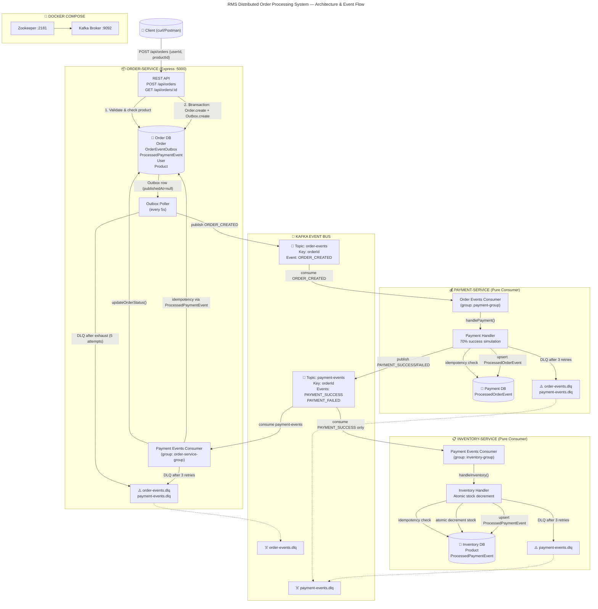

# RMS — Complete Event & Data Flow Flowchart



```
=====================================================================================================================
                                RMS: DISTRIBUTED ORDER PROCESSING SYSTEM
                          (Event-Driven Architecture + Transactional Outbox Pattern)
=====================================================================================================================

                                    ╔══════════════════════════════════════╗
                                    ║         DOCKER COMPOSE              ║
                                    ║    (docker-compose.yml)             ║
                                    ║                                      ║
                                    ║  ┌──────────────────────────────┐   ║
                                    ║  │     Zookeeper :2181          │   ║
                                    ║  │  (confluentinc/cp-zookeeper)  │   ║
                                    ║  └──────────┬───────────────────┘   ║
                                    ║             │ manages               ║
                                    ║  ┌──────────▼───────────────────┐   ║
                                    ║  │  Kafka Broker :9092          │   ║
                                    ║  │  (confluentinc/cp-kafka:7.5) │   ║
                                    ║  │  PLAINTEXT://localhost:9092  │   ║
                                    ║  └──────────┬───────────────────┘   ║
                                    ╚═════════════╬═══════════════════════╝
                                                  │
                    ┌─────────────────────────────┼─────────────────────────────┐
                    │                             │                             │
                    ▼                             ▼                             ▼
        ┌───────────────────────────┐   ┌───────────────────────┐   ┌───────────────────────────┐
        │      ORDER SERVICE        │   │    PAYMENT SERVICE    │   │     INVENTORY SERVICE      │
        │    (Express HTTP :5000)   │   │   (Pure Kafka Cxn)    │   │    (Pure Kafka Cxn)        │
        └───────────────────────────┘   └───────────────────────┘   └───────────────────────────┘
                    │                             │                             │
                    ▼                             ▼                             ▼
        ┌───────────────────────────┐   ┌───────────────────────┐   ┌───────────────────────────┐
        │    PostgreSQL DB #1       │   │   PostgreSQL DB #2    │   │    PostgreSQL DB #3        │
        │  (order-service-db)       │   │(payment-service-db)   │   │  (inventory-service-db)    │
        │                           │   │                       │   │                            │
        │  Tables:                  │   │  Tables:              │   │  Tables:                   │
        │  ┌─────────────────────┐  │   │  ┌─────────────────┐  │   │  ┌─────────────────────┐   │
        │  │ User                │  │   │  │ProcessedOrderEv │  │   │  │ Product             │   │
        │  │ id: String (PK)     │  │   │  │ id: String (PK) │  │   │  │ id: String (PK)     │   │
        │  │ name: String        │  │   │  │ eventType: Str  │  │   │  │ name: String        │   │
        │  │ email: String (UQ)  │  │   │  │ orderId: String │  │   │  │ price: Float        │   │
        │  └─────────────────────┘  │   │  │ processedAt:    │  │   │  │ stock: Int          │   │
        │  ┌─────────────────────┐  │   │  │   DateTime      │  │   │  └─────────────────────┘   │
        │  │ Product             │  │   │  │ Index: [orderId]│  │   │  ┌─────────────────────┐   │
        │  │ id: String (PK)     │  │   │  └─────────────────┘  │   │  │ProcessedPaymentEv   │   │
        │  │ name: String        │  │   │                       │   │  │ id: String (PK)     │   │
        │  │ price: Float        │  │   │                       │   │  │ eventType: Str      │   │
        │  └─────────────────────┘  │   │                       │   │  │ orderId: String     │   │
        │  ┌─────────────────────┐  │   │                       │   │  │ productId: Str      │   │
        │  │ Order               │  │   │                       │   │  │ processedAt:        │   │
        │  │ id: String (PK)     │  │   │                       │   │  │   DateTime          │   │
        │  │ userId: String      │  │   │                       │   │  │ Index: [orderId]    │   │
        │  │ productId: Str      │  │   │                       │   │  └─────────────────────┘   │
        │  │ status: String      │  │   │                       │   │                            │
        │  │ createdAt: DateTime │  │   │                       │   │                            │
        │  └─────────────────────┘  │   │                       │   │                            │
        │  ┌─────────────────────┐  │   │                       │   │                            │
        │  │OrderEventOutbox     │  │   │                       │   │                            │
        │  │ id: String (PK)     │  │   │                       │   │                            │
        │  │ orderId: Str        │  │   │                       │   │                            │
        │  │ eventType: Str      │  │   │                       │   │                            │
        │  │ eventPayload: Json  │  │   │                       │   │                            │
        │  │ createdAt: DateTime │  │   │                       │   │                            │
        │  │ publishedAt:        │  │   │                       │   │                            │
        │  │   DateTime?         │  │   │                       │   │                            │
        │  │ publishAttempts:    │  │   │                       │   │                            │
        │  │   Int (def: 0)      │  │   │                       │   │                            │
        │  │ lastError: String?  │  │   │                       │   │                            │
        │  │ Index: [publishedAt]│  │   │                       │   │                            │
        │  │ Index: [createdAt]  │  │   │                       │   │                            │
        │  └─────────────────────┘  │   │                       │   │                            │
        │  ┌─────────────────────┐  │   │                       │   │                            │
        │  │ProcessedPaymentEv   │  │   │                       │   │                            │
        │  │ id: String (PK)     │  │   │                       │   │                            │
        │  │ eventType: Str      │  │   │                       │   │                            │
        │  │ orderId: String     │  │   │                       │   │                            │
        │  │ processedAt:        │  │   │                       │   │                            │
        │  │   DateTime          │  │   │                       │   │                            │
        │  │ Index: [orderId]    │  │   │                       │   │                            │
        │  └─────────────────────┘  │   │                       │   │                            │
        └───────────────────────────┘   └───────────────────────┘   └───────────────────────────┘


====================================================================================================================
                                        KAFKA TOPIC ARCHITECTURE
====================================================================================================================

    ┌──────────────────────────────────────────────────────────────────────────────────────────────────────┐
    │                                        KAFKA BROKER (:9092)                                          │
    │                                                                                                      │
    │   ┌──────────────────────────────────────────────────────────────────────────────────────────────┐   │
    │   │  TOPIC: "order-events"                                                                       │   │
    │   │  ┌────────────────────────────────────────────────────────────────────────────────────────┐  │   │
    │   │  │  Event Type: ORDER_CREATED                                                             │  │   │
    │   │  │  Key: orderId (partition affinity / ordering per order)                                │  │   │
    │   │  │  Value: { type, eventId, orderId, userId, productId, timeStamp }                       │  │   │
    │   │  └────────────────────────────────────────────────────────────────────────────────────────┘  │   │
    │   └──────────────────────────────────────────────────────────────────────────────────────────────┘   │
    │                                                                                                      │
    │   ┌──────────────────────────────────────────────────────────────────────────────────────────────┐   │
    │   │  TOPIC: "payment-events"                                                                      │   │
    │   │  ┌────────────────────────────────────────────────────────────────────────────────────────┐  │   │
    │   │  │  Event Types: PAYMENT_SUCCESS, PAYMENT_FAILED                                          │  │   │
    │   │  │  Key: orderId                                                                          │  │   │
    │   │  │  Value: { type, eventId, orderId, userId, productId, timestamp, reason? }              │  │   │
    │   │  └────────────────────────────────────────────────────────────────────────────────────────┘  │   │
    │   └──────────────────────────────────────────────────────────────────────────────────────────────┘   │
    │                                                                                                      │
    │   ┌──────────────────────────────────────────────────────────────────────────────────────────────┐   │
    │   │  ☠️  DLQ TOPICS (Dead Letter Queue)                                                          │   │
    │   │                                                                                              │   │
    │   │  "order-events.dlq"  ← Poison/unparseable messages from order-events                         │   │
    │   │  "payment-events.dlq" ← Exhausted-retry / poison messages from payment-events                │   │
    │   │                                                                                              │   │
    │   │  DLQ messages contain: { originalTopic, failedAt, error, originalPayload, eventId? }         │   │
    │   └──────────────────────────────────────────────────────────────────────────────────────────────┘   │
    │                                                                                                      │
    │   Consumer Groups:                                                                                   │
    │   ┌──────────────────────────────────────────────────────────────────────────────────────────────┐   │
    │   │  "payment-group"         →  payment-service   (reads "order-events")                         │   │
    │   │  "order-service-group"   →  order-service     (reads "payment-events")                       │   │
    │   │  "inventory-group"       →  inventory-service (reads "payment-events")                       │   │
    │   └──────────────────────────────────────────────────────────────────────────────────────────────┘   │
    └──────────────────────────────────────────────────────────────────────────────────────────────────────┘


====================================================================================================================
                      COMPLETE EVENT & DATA FLOW — STEP BY STEP WITH FUNCTION-LEVEL DETAIL
====================================================================================================================

┌─────────────────────────────────────────────────────────────────────────────────────────────────────────────┐
│  PHASE 1: CLIENT → ORDER-SERVICE (REST API)                                                                  │
│  FILE: src/controllers/order.controller.ts  |  src/routes/order.routes.ts  |  src/app.ts                     │
└─────────────────────────────────────────────────────────────────────────────────────────────────────────────┘

  ┌──────────┐
  │  CLIENT  │
  │ (curl /  │
  │  Postman)│
  └────┬─────┘
       │
       │  POST /api/orders
       │  Body: { "userId": "uuid", "productId": "uuid" }
       │
       ▼
  ┌──────────────────────────────────────────────────────────────────────────────────────┐
  │  order-service: Express Middleware Chain (src/app.ts:7-10)                           │
  │                                                                                      │
  │   1. cors()                          →  Adds CORS headers                           │
  │   2. express.json()                  →  Parses JSON request body                    │
  │   3. Router at /api                  →  Routes to orderRoutes (src/routes/order.routes.ts:9)  │
  │      POST /orders                    →  createOrder controller                      │
  │      GET  /orders/:orderId           →  getOrder controller                         │
  └──────────────────────────────────────────────────────────────────────────────────────┘
       │
       ▼
  ┌──────────────────────────────────────────────────────────────────────────────────────┐
  │  FUNCTION: createOrder(req, res)  (src/controllers/order.controller.ts:5-85)         │
  │                                                                                      │
  │  ├─ STEP 1: Validate request body                           (line 7-16)             │
  │  │    const { userId, productId } = req.body                                        │
  │  │    if !userId || !productId → res.status(400).json({ error: "Missing..." })      │
  │  │    return                                                                         │
  │  │                                                                                   │
  │  ├─ STEP 2: Verify product exists in local DB              (line 18-26)              │
  │  │    const product = await prisma.product.findUnique({                              │
  │  │      where: { id: productId }                                                     │
  │  │    })                                                                              │
  │  │    if !product → res.status(400).json({ error: "Product not found" })             │
  │  │    return                                                                         │
  │  │                                                                                   │
  │  ├─ STEP 3: Generate outboxEventId                        (line 33)                 │
  │  │    const outboxEventId = randomUUID()                                            │
  │  │    ↓ Used as:                                                                     │
  │  │      • Outbox row PK                                                                │
  │  │      • Embedding eventId inside the event payload                                  │
  │  │      • Downstream consumers dedupe on this eventId                                 │
  │  │                                                                                   │
  │  ├─ STEP 4: Prisma $transaction (Atomic write)            (line 37-63)              │
  │  │    ┌──────────────────────────────────────────────────────────────────────────┐   │
  │  │    │  tx.order.create({                                                        │   │
  │  │    │    data: { userId, productId, status: "PENDING" }                         │   │
  │  │    │  })                                                                        │   │
  │  │    │  → INSERT INTO "Order" (id, userId, productId, status, createdAt)         │   │
  │  │    └──────────────────────┬───────────────────────────────────────────────────┘   │
  │  │                           │                                                       │
  │  │                           ▼                                                       │
  │  │    ┌──────────────────────────────────────────────────────────────────────────┐   │
  │  │    │  tx.orderEventOutbox.create({                                            │   │
  │  │    │    id: outboxEventId,                                                     │   │
  │  │    │    orderId: order.id,                                                     │   │
  │  │    │    eventType: "ORDER_CREATED",                                            │   │
  │  │    │    eventPayload: {                                                        │   │
  │  │    │      type: "ORDER_CREATED",                                               │   │
  │  │    │      eventId: outboxEventId,                                              │   │
  │  │    │      orderId: order.id,                                                   │   │
  │  │    │      userId, productId,                                                   │   │
  │  │    │      timeStamp: new Date().toISOString()                                  │   │
  │  │    │    },                                                                      │   │
  │  │    │    publishedAt: null,       ← Not published yet                           │   │
  │  │    │    publishAttempts: 0                                                     │   │
  │  │    │  })                                                                        │   │
  │  │    │  → INSERT INTO order_event_outbox (...)                                    │   │
  │  │    └──────────────────────────────────────────────────────────────────────────┘   │
  │  │                                                                                   │
  │  │  ⚠️  BOTH writes happen in ONE DB transaction.                                   │
  │  │  If Kafka is down → no problem. Outbox poller publishes later.                   │
  │  │                                                                                   │
  │  ├─ STEP 5: Return 201 Created                         (line 67-77)                │
  │  │    res.status(201).json({                                                         │
  │  │      success: true,                                                               │
  │  │      message: "Order created successfully. Processing payment...",                │
  │  │      order: { id, userId, productId, status: "PENDING", createdAt }              │
  │  │    })                                                                              │
  │  │                                                                                   │
  │  └─ CATCH:  (line 78-84)                                                            │
  │       if transaction fails → res.status(500).json({ error: "Failed..." })           │
  │                                                                                      │
  │  ╔══════════════════════════════════════════════════════════════════════╗            │
  │  ║  KEY: At this point, Order is PENDING in DB, and Outbox has an     ║            │
  │  ║  unpublished event. Even if Kafka is down, data is safely persisted.║            │
  │  ╚══════════════════════════════════════════════════════════════════════╝            │
  └──────────────────────────────────────────────────────────────────────────────────────┘
       │
       ▼  [Client may poll GET /api/orders/:orderId to check status]


┌─────────────────────────────────────────────────────────────────────────────────────────────────────────────┐
│  PHASE 2: OUTBOX POLLER → KAFKA (Transactional Outbox Pattern)                                              │
│  FILE: src/kafka/outbox-poller.ts                                                                           │
└─────────────────────────────────────────────────────────────────────────────────────────────────────────────┘

  ┌──────────────────────────────────────────────────────────────────────────────────────────────────────────┐
  │  FUNCTION: startOutboxPoller()  (src/kafka/outbox-poller.ts:102-107)                                      │
  │                                                                                                           │
  │  • Runs runOnce() immediately on startup                                                                    │
  │  • Then runs every POLL_INTERVAL_MS = 5000ms via setInterval(runOnce, 5000)                               │
  │  • Returns a timer handle for graceful shutdown (stopOutboxPoller → clearInterval)                         │
  └──────────────────────────────────────────────────────────────────────────────────────────────────────────┘
       │
       ▼  (every 5 seconds)
  ┌──────────────────────────────────────────────────────────────────────────────────────────────────────────┐
  │  FUNCTION: runOnce()  (src/kafka/outbox-poller.ts:11-100)                                                │
  │                                                                                                           │
  │  ├─ STEP 1: Query unpublished events                          (line 13-22)                               │
  │  │    prisma.orderEventOutbox.findMany({                                                                   │
  │  │      where: { publishedAt: null, publishAttempts: { lt: MAX_ATTEMPTS(5) } },                            │
  │  │      orderBy: { createdAt: "asc" },  ← oldest first                                                 │
  │  │      take: 10                        ← batch size                                                  │
  │  │    })                                                                                                   │
  │  │    if pendingEvents.length === 0 → return (nothing to do)                                              │
  │  │                                                                                                         │
  │  ├─ STEP 2: For EACH pending event (sequential — not parallel):          (line 30-99)                      │
  │  │                                                                                                         │
  │  │    ┌──────────────────────────────────────────────────────────────────────────────────────────────┐    │
  │  │    │  ATTEMPT SEND TO KAFKA (with 2-level retry)                                                  │    │
  │  │    │                                                                                                │    │
  │  │    │  await withRetry(                                                                              │    │
  │  │    │    () => producer.send({                                                                       │    │
  │  │    │      topic: "order-events",                                                                    │    │
  │  │    │      messages: [{ key: event.orderId,                                                          │    │
  │  │    │                  value: JSON.stringify(event.eventPayload) }]                                  │    │
  │  │    │    }),                                                                                          │    │
  │  │    │    { retries: 2, baseDelayMs: 200 }  ← In-cycle fast retries                                   │    │
  │  │    │  )                                                                                              │    │
  │  │    └────────────────┬─────────────────────────────────────────────────────────────────────────────┘    │
  │  │                     │                                                                                   │
  │  │              ┌──────┴──────┐                                                                           │
  │  │              ▼              ▼                                                                           │
  │  │        ┌──────────┐  ┌─────────────────────────────────────────────────────────────────────────────┐   │
  │  │        │ SUCCESS  │  │ FAILURE (after 2 in-cycle retries exhausted)                                │   │
  │  │        └────┬─────┘  └──────────────────┬──────────────────────────────────────────────────────────┘   │
  │  │             │                            │                                                              │
  │  │             ▼                            ▼                                                              │
  │  │       ┌────────────────────┐   ┌──────────────────────────────────────────────────────────────────┐   │
  │  │       │ Mark as published  │   │ Increment publishAttempts + record lastError                      │   │
  │  │       │                    │   │                                                                    │   │
  │  │       │ prisma.            │   │ prisma.orderEventOutbox.update({                                  │   │
  │  │       │ orderEventOutbox   │   │   where: { id: event.id },                                        │   │
  │  │       │ .update({          │   │   data: { publishAttempts: { increment: 1 },                      │   │
  │  │       │   where: { id:     │   │            lastError: errorMessage }                              │   │
  │  │       │     event.id },    │   │ })                                                                  │   │
  │  │       │   data: {          │   │                                                                    │   │
  │  │       │     publishedAt:   │   │  if attemptsSoFar >= MAX_ATTEMPTS(5):                              │   │
  │  │       │     new Date()     │   │    🚨 "Exhausted retry bound. Manual investigation required."      │   │
  │  │       │   }                │   │    💀 Event is dead-lettered — never retried again                  │   │
  │  │       │ })                 │   └──────────────────────────────────────────────────────────────────┘   │
  │  │       └────────────────────┘                                                                           │
  │  │                                                                                                         │
  │  │  ╔══════════════════════════════════════════════════════════════════════════════════════╗               │
  │  │  ║  ★ TWO-LEVEL RETRY BOUNDARY:                                                        ║               │
  │  │  ║  Level 1 (In-cycle): 2 fast retries via withRetry, 200ms base, exponential+jitter    ║               │
  │  │  ║  Level 2 (Cross-cycle): max 5 cycles (~25 seconds of retries)                        ║               │
  │  │  ║  If BOTH exhausted → 💀 Dead letter (no more retries)                                ║               │
  │  │  ╚══════════════════════════════════════════════════════════════════════════════════════╝               │
  │  └─────────────────────────────────────────────────────────────────────────────────────────────────────────┘
  │
  ▼
  ┌──────────────────────────────────────────────────────────────────────────────────────────────────────────┐
  │  KAFKA TOPIC: "order-events"                                                                              │
  │                                                                                                           │
  │  Message: {                                                                                               │
  │    "type": "ORDER_CREATED",                                                                               │
  │    "eventId": "uuid",        ← Same as outbox row id (for downstream idempotency)                        │
  │    "orderId": "uuid",                                                                                     │
  │    "userId": "uuid",                                                                                      │
  │    "productId": "uuid",                                                                                   │
  │    "timeStamp": "2026-07-09T..."                                                                          │
  │  }                                                                                                         │
  │  Key: orderId   (partition key — ensures ordering per order)                                              │
  └──────────────────────────────────────────────────────────────────────────────────────────────────────────┘


┌─────────────────────────────────────────────────────────────────────────────────────────────────────────────┐
│  PHASE 3: PAYMENT-SERVICE → PAYMENT PROCESSING                                                               │
│  FILES: src/kafka/consumer.ts  |  src/handlers/payment.handler.ts  |  src/utils/retry.ts  |  src/kafka/dlq.ts│
└─────────────────────────────────────────────────────────────────────────────────────────────────────────────┘

  ┌──────────────────────────────────────────────────────────────────────────────────────────────────────────┐
  │  FUNCTION: startConsumer()  (src/kafka/consumer.ts:14-51)                                                │
  │                                                                                                           │
  │  • KafkaJS consumer in group "payment-group"                                                              │
  │  • Subscribes to topic: "order-events" (fromBeginning: true)                                              │
  │  • Runs eachMessage() for every message in the topic                                                      │
  └──────────────────────────────────────────────────────────────────────────────────────────────────────────┘
       │
       │  Message received from "order-events"
       ▼
  ┌──────────────────────────────────────────────────────────────────────────────────────────────────────────┐
  │  eachMessage() handler  (src/kafka/consumer.ts:22-49)                                                     │
  │                                                                                                           │
  │  ├─ STEP 1: Parse message                                   (line 29)                                    │
  │  │    const data = JSON.parse(raw ?? "")  ← safe parse (defaults to empty string for null)               │
  │  │    if malformed → catch(err) → sendToDlq({...}) → continue (never crash consumer)                     │
  │  │                                                                                                         │
  │  ├─ STEP 2: Route by type                                   (line 30-33)                                 │
  │  │    if data.type === "ORDER_CREATED" → await handlePayment(data)                                        │
  │  │    else → console.log("Ignored event type")                                                             │
  │  │                                                                                                         │
  │  └─ CATCH:  (line 35-48)                                                                                  │
  │       Guards against unparseable ("poison") messages. Sends raw payload to DLQ.                            │
  │       await sendToDlq({ originalTopic: "order-events", failedAt, error, originalPayload: raw })            │
  └──────────────────────────────────────────────────────────────────────────────────────────────────────────┘
       │
       ▼
  ┌──────────────────────────────────────────────────────────────────────────────────────────────────────────┐
  │  FUNCTION: handlePayment(event)  (src/handlers/payment.handler.ts:10-118)                                 │
  │                                                                                                           │
  │  Input: { orderId, userId, productId, eventId }                                                           │
  │                                                                                                           │
  │  ┌─ IDEMPOTENCY CHECK ───────────────────────────────────────────────────────────────────────────────┐   │
  │  │                                                                                                    │   │
  │  │  if eventId exists:                              (line 14-26)                                     │   │
  │  │    const alreadyProcessed = await prisma.processedOrderEvent.findUnique({                          │   │
  │  │      where: { id: eventId }                                                                         │   │
  │  │    })                                                                                                │   │
  │  │    if alreadyProcessed:                                                                              │   │
  │  │      console.log("Duplicate ORDER_CREATED event detected. Skipping")                                │   │
  │  │      return ← ack the message, do nothing else                                                     │   │
  │  │                                                                                                     │   │
  │  │  else:                                                                                               │   │
  │  │    console.warn("Event has no eventId — cannot deduplicate. Processing anyway.")                    │   │
  │  └─────────────────────────────────────────────────────────────────────────────────────────────────────┘   │
  │                                                                                                           │
  │  ┌─ GENERATE PAYMENT EVENT ID ───────────────────────────────────────────────────────────────────────┐   │
  │  │                                                                                                    │   │
  │  │  const paymentEventId = randomUUID()                           (line 38)                          │   │
  │  │  Generated ONCE, before any retries. Every retry reuses the same paymentEventId.                   │   │
  │  │  → Downstream consumers dedupe on this ID, preventing double-processing.                           │   │
  │  └─────────────────────────────────────────────────────────────────────────────────────────────────────┘   │
  │                                                                                                           │
  │  ┌─ SIMULATE PAYMENT DECISION ──────────────────────────────────────────────────────────────────────┐   │
  │  │                                                                                                    │   │
  │  │  const isSuccess = Math.random() > 0.3  ← 70% success rate       (line 43)                       │   │
  │  │  await new Promise(r => setTimeout(r, 500))  ← Simulate 500ms processing delay (line 46)          │   │
  │  │                                                                                                    │   │
  │  │  ⚠️ Outcome is decided ONCE. Retries only cover infra hiccups, never re-roll payment result.      │   │
  │  │                                                                                                    │   │
  │  │  Build paymentEvent object:                                          (line 48-65)                  │   │
  │  │    if isSuccess:                                                                                    │   │
  │  │      { type: "PAYMENT_SUCCESS", eventId: paymentEventId, orderId, userId, productId, timestamp }   │   │
  │  │    else:                                                                                            │   │
  │  │      { type: "PAYMENT_FAILED", eventId: paymentEventId, orderId, userId, productId, timestamp,     │   │
  │  │        reason: "Payment declined - insufficient funds" }                                           │   │
  │  └─────────────────────────────────────────────────────────────────────────────────────────────────────┘   │
  │                                                                                                           │
  │  ┌─ PUBLISH RESULT with RETRY ───────────────────────────────────────────────────────────────────────┐   │
  │  │                                                                                                    │   │
  │  │  try {                                                                                              │   │
  │  │    await withRetry(                                                                                 │   │
  │  │      () => publishPaymentResult(paymentEvent, eventId, orderId),                                    │   │
  │  │      {                                                                                              │   │
  │  │        retries: MAX_PUBLISH_RETRIES (3),                    (line 74)                              │   │
  │  │        baseDelayMs: 300,                                                                             │   │
  │  │        onRetry: (err, attempt, delayMs) => { log retry }                                            │   │
  │  │      }                                                                                               │   │
  │  │    )                                                                                                 │   │
  │  │  } catch (err) {                                                                                     │   │
  │  │    🚨 Bounded: after 3 retries → sendToDlq({...}) instead of losing event          (line 96-102)   │   │
  │  │    await sendToDlq({                                                                                 │   │
  │  │      originalTopic: "payment-events",                                                                │   │
  │  │      failedAt: new Date().toISOString(),                                                              │   │
  │  │      error: err.message,                                                                              │   │
  │  │      originalPayload: paymentEvent,                                                                   │   │
  │  │      eventId: paymentEventId                                                                          │   │
  │  │    })                                                                                                 │   │
  │  │  }                                                                                                    │   │
  │  └─────────────────────────────────────────────────────────────────────────────────────────────────────┘   │
  │                                                                                                           │
  │  ┌─ OUTER CATCH (safety net) ───────────────────────────────────────────────────────────────────────┐   │
  │  │                                                                                                    │   │
  │  │  Catches unexpected errors (e.g. idempotency check DB failure). Sends to DLQ.                      │   │
  │  │  await sendToDlq({ originalTopic: "order-events", ... })                    (line 110-117)        │   │
  │  └─────────────────────────────────────────────────────────────────────────────────────────────────────┘   │
  └──────────────────────────────────────────────────────────────────────────────────────────────────────────┘
       │
       ▼
  ┌──────────────────────────────────────────────────────────────────────────────────────────────────────────┐
  │  FUNCTION: publishPaymentResult(paymentEvent, eventId, orderId)  (src/handlers/payment.handler.ts:120-149)│
  │                                                                                                           │
  │  STEP 1: Publish to Kafka "payment-events"                        (line 125-133)                        │
  │    await producer.send({                                                                                  │
  │      topic: "payment-events",                                                                             │
  │      messages: [{ key: orderId, value: JSON.stringify(paymentEvent) }]                                   │
  │    })                                                                                                      │
  │                                                                                                           │
  │  STEP 2: Record idempotency (upsert)                              (line 135-148)                        │
  │    if (eventId) {                                                                                         │
  │      await prisma.processedOrderEvent.upsert({                                                           │
  │        where: { id: eventId },                                                                             │
  │        create: { id: eventId, eventType: "ORDER_CREATED", orderId },                                     │
  │        update: {}  ← no-op on conflict                                                                  │
  │      })                                                                                                    │
  │    }                                                                                                       │
  │                                                                                                           │
  │  ⚠️ Uses upsert instead of create. A retry may re-enter after a previous                                  │
  │  attempt's write committed but the response was lost. upsert handles this safely.                          │
  └──────────────────────────────────────────────────────────────────────────────────────────────────────────┘
       │
       │  PAYMENT_SUCCESS or PAYMENT_FAILED published to "payment-events"
       ▼
  ┌──────────────────────────────────────────────────────────────────────────────────────────────────────────┐
  │  KAFKA TOPIC: "payment-events"                                                                             │
  │                                                                                                           │
  │  Message (SUCCESS): {                                                                                     │
  │    "type": "PAYMENT_SUCCESS",                                                                             │
  │    "eventId": "uuid",                                                                                     │
  │    "orderId": "uuid",                                                                                     │
  │    "userId": "uuid",                                                                                      │
  │    "productId": "uuid",                                                                                   │
  │    "timestamp": "2026-07-09T..."                                                                          │
  │  }                                                                                                         │
  │                                                                                                           │
  │  Message (FAILED): {                                                                                      │
  │    "type": "PAYMENT_FAILED",                                                                              │
  │    "eventId": "uuid",                                                                                     │
  │    "orderId": "uuid",                                                                                     │
  │    "userId": "uuid",                                                                                      │
  │    "productId": "uuid",                                                                                   │
  │    "timestamp": "2026-07-09T...",                                                                         │
  │    "reason": "Payment declined - insufficient funds"                                                      │
  │  }                                                                                                         │
  │                                                                                                           │
  │  Key: orderId                                                                                              │
  └──────────────────────────────────────────────────────────────────────────────────────────────────────────┘


┌─────────────────────────────────────────────────────────────────────────────────────────────────────────────┐
│  PHASE 4A: ORDER-SERVICE CONSUMER → UPDATE ORDER STATUS                                                      │
│  FILES: src/kafka/consumer.ts  |  src/kafka/dlq.ts  |  src/utils/retry.ts                                    │
└─────────────────────────────────────────────────────────────────────────────────────────────────────────────┘

  ┌──────────────────────────────────────────────────────────────────────────────────────────────────────────┐
  │  FUNCTION: startOrderConsumer()  (src/kafka/consumer.ts:57-152)                                          │
  │                                                                                                           │
  │  • KafkaJS consumer in group "order-service-group"                                                        │
  │  • Subscribes to topic: "payment-events" (fromBeginning: false)                                           │
  │  • Runs eachMessage() for every message in the topic                                                      │
  └──────────────────────────────────────────────────────────────────────────────────────────────────────────┘
       │
       │  Message received from "payment-events"
       ▼
  ┌──────────────────────────────────────────────────────────────────────────────────────────────────────────┐
  │  eachMessage() handler  (src/kafka/consumer.ts:69-146)                                                    │
  │                                                                                                           │
  │  ├─ STEP 1: Parse message                                   (line 73)                                    │
  │  │    const data = JSON.parse(raw ?? "")                                                                  │
  │  │    if malformed → catch → sendToDlq({...})                                                             │
  │  │                                                                                                         │
  │  ├─ STEP 2: IDEMPOTENCY CHECK                             (line 76-95)                                   │
  │  │    const eventId = data.eventId                                                                         │
  │  │    if eventId exists:                                                                                   │
  │  │      const alreadyProcessed = await prisma.processedPaymentEvent.findUnique({                          │
  │  │        where: { id: eventId }                                                                           │
  │  │      })                                                                                                  │
  │  │      if alreadyProcessed:                                                                               │
  │  │        console.log("Duplicate event detected. Skipping")                                               │
  │  │        return ← ack, do nothing                                                                       │
  │  │    else:                                                                                                 │
  │  │      console.warn("Cannot deduplicate. Processing anyway.")                                            │
  │  │                                                                                                         │
  │  ├─ STEP 3: Route by type                                (line 97-98)                                    │
  │  │    if data.type === "PAYMENT_SUCCESS": status = "COMPLETED"                                            │
  │  │    else if data.type === "PAYMENT_FAILED": status = "FAILED"                                           │
  │  │    else → log "Ignored event type"                                                                     │
  │  │                                                                                                         │
  │  ├─ STEP 4: Update order status with retry                 (line 100-131)                                 │
  │  │    try {                                                                                                │
  │  │      await withRetry(                                                                                   │
  │  │        () => updateOrderStatus(data.orderId, status, data.type, eventId, data.reason),                  │
  │  │        { retries: MAX_STATUS_UPDATE_RETRIES (3), baseDelayMs: 300 }                                    │
  │  │      )                                                                                                  │
  │  │    } catch (err) {                                                                                      │
  │  │      🚨 After 3 retries exhausted:                                                                     │
  │  │      await sendToDlq({                                                                                  │
  │  │        originalTopic: "payment-events",                                                                 │
  │  │        failedAt: new Date().toISOString(),                                                              │
  │  │        error: err.message,                                                                              │
  │  │        originalPayload: data,                                                                           │
  │  │        eventId                                                                                          │
  │  │      })                                                                                                  │
  │  │    }                                                                                                    │
  │  │                                                                                                         │
  │  └─ CATCH (poison message):                              (line 135-144)                                   │
  │       try/catch around JSON.parse. Sends unparsed raw message to DLQ.                                     │
  │       await sendToDlq({ originalTopic: "payment-events", originalPayload: raw })                           │
  │       (Consumer never crashes from a bad message)                                                         │
  └──────────────────────────────────────────────────────────────────────────────────────────────────────────┘
       │
       ▼
  ┌──────────────────────────────────────────────────────────────────────────────────────────────────────────┐
  │  FUNCTION: updateOrderStatus(orderId, status, eventType, eventId, reason?)  (src/kafka/consumer.ts:16-55) │
  │                                                                                                           │
  │  Runs in Prisma $transaction:                                                                             │
  │                                                                                                           │
  │  ┌──────────────────────────────────────────────────────────────────────────────────────────────────┐    │
  │  │  1. tx.order.update({                                                                             │    │
  │  │       where: { id: orderId },                                                                      │    │
  │  │       data: { status }  ← "COMPLETED" or "FAILED"                                                │    │
  │  │     })                                                                                              │    │
  │  └────────────────────────────────┬─────────────────────────────────────────────────────────────────┘    │
  │                                   │                                                                        │
  │                                   ▼                                                                        │
  │  ┌──────────────────────────────────────────────────────────────────────────────────────────────────┐    │
  │  │  2. if (eventId) {                                                                                │    │
  │  │       tx.processedPaymentEvent.upsert({                                                            │    │
  │  │         where: { id: eventId },                                                                    │    │
  │  │         create: { id: eventId, eventType, orderId },                                               │    │
  │  │         update: {}  ← no-op on conflict                                                          │    │
  │  │       })                                                                                            │    │
  │  │     }                                                                                               │    │
  │  │     (Marks the PAYMENT_SUCCESS/PAYMENT_FAILED event as processed —                                  │    │
  │  │      future duplicates will be skipped)                                                             │    │
  │  └──────────────────────────────────────────────────────────────────────────────────────────────────┘    │
  │                                                                                                           │
  │  Logs:                                                                                                    │
  │    ✅ "Order {orderId} marked as COMPLETED"                                                               │
  │  or                                                                                                       │
  │    ❌ "Order {orderId} marked as FAILED"                                                                  │
  │       "Reason: Payment declined - insufficient funds"                                                     │
  └──────────────────────────────────────────────────────────────────────────────────────────────────────────┘
       │
       │  Now client polling GET /api/orders/:orderId will see:
       │  { status: "COMPLETED" }  or  { status: "FAILED" }


┌─────────────────────────────────────────────────────────────────────────────────────────────────────────────┐
│  PHASE 4B: INVENTORY-SERVICE CONSUMER → DECREMENT STOCK                                                      │
│  FILES: src/kafka/consumer.ts  |  src/handlers/inventory.handler.ts  |  src/kafka/dlq.ts                     │
└─────────────────────────────────────────────────────────────────────────────────────────────────────────────┘

  ┌──────────────────────────────────────────────────────────────────────────────────────────────────────────┐
  │  FUNCTION: startConsumer()  (src/kafka/consumer.ts:14-53)                                                │
  │                                                                                                           │
  │  • KafkaJS consumer in group "inventory-group"                                                            │
  │  • Subscribes to topic: "payment-events" (fromBeginning: false)                                           │
  │  • Runs eachMessage() for every message                                                                   │
  │  • IMPORTANT: Inventory service also connects a producer for DLQ publishing (src/index.ts:10)            │
  └──────────────────────────────────────────────────────────────────────────────────────────────────────────┘
       │
       │  Message received from "payment-events"
       ▼
  ┌──────────────────────────────────────────────────────────────────────────────────────────────────────────┐
  │  eachMessage() handler  (src/kafka/consumer.ts:25-51)                                                     │
  │                                                                                                           │
  │  ├─ STEP 1: Parse message                                   (line 29)                                    │
  │  │    const data = JSON.parse(raw ?? "")                                                                  │
  │  │    if malformed → catch → sendToDlq({...})                                                             │
  │  │                                                                                                         │
  │  ├─ STEP 2: Route by type                                   (line 33-36)                                 │
  │  │    if data.type === "PAYMENT_SUCCESS" → await handleInventory(data)                                    │
  │  │    else → console.log("Ignored event type")                                                             │
  │  │    (PAYMENT_FAILED is ignored — no stock adjustment needed)                                            │
  │  │                                                                                                         │
  │  └─ CATCH (poison message):                              (line 39-49)                                    │
  │       await sendToDlq({ originalTopic: "payment-events", originalPayload: raw })                          │
  └──────────────────────────────────────────────────────────────────────────────────────────────────────────┘
       │
       ▼
  ┌──────────────────────────────────────────────────────────────────────────────────────────────────────────┐
  │  FUNCTION: handleInventory(event)  (src/handlers/inventory.handler.ts:8-69)                              │
  │                                                                                                           │
  │  Input: { orderId, productId, eventId }                                                                   │
  │                                                                                                           │
  │  ┌─ IDEMPOTENCY CHECK ───────────────────────────────────────────────────────────────────────────────┐   │
  │  │                                                                                                    │   │
  │  │  if eventId exists:                                (line 15-27)                                   │   │
  │  │    const alreadyProcessed = await prisma.processedPaymentEvent.findUnique({                        │   │
  │  │      where: { id: eventId }                                                                         │   │
  │  │    })                                                                                                │   │
  │  │    if alreadyProcessed:                                                                              │   │
  │  │      console.log("Duplicate PAYMENT_SUCCESS event detected. Skipping")                              │   │
  │  │      return ← ack, do nothing                                                                     │   │
  │  │                                                                                                     │   │
  │  │  else:                                                                                               │   │
  │  │    console.warn("Event has no eventId — cannot deduplicate. Processing anyway.")                    │   │
  │  └─────────────────────────────────────────────────────────────────────────────────────────────────────┘   │
  │                                                                                                           │
  │  ┌─ ATOMIC STOCK DECREMENT (with retry) ────────────────────────────────────────────────────────────┐   │
  │  │                                                                                                    │   │
  │  │  try {                                                                                              │   │
  │  │    await withRetry(                                                                                 │   │
  │  │      () => decrementStockAndMarkProcessed(orderId, productId, eventId),                             │   │
  │  │      { retries: MAX_UPDATE_RETRIES (3), baseDelayMs: 300 }                       (line 31-42)     │   │
  │  │    )                                                                                                 │   │
  │  │  } catch (err) {                                                                                     │   │
  │  │    🚨 After 3 retries exhausted:              (line 43-58)                                          │   │
  │  │    await sendToDlq({ originalTopic: "payment-events", originalPayload: event, eventId })             │   │
  │  │  }                                                                                                    │   │
  │  └─────────────────────────────────────────────────────────────────────────────────────────────────────┘   │
  │                                                                                                           │
  │  ┌─ OUTER CATCH ────────────────────────────────────────────────────────────────────────────────────┐   │
  │  │                                                                                                    │   │
  │  │  Catches unexpected errors (e.g. idempotency check fails). Sends to DLQ.         (line 59-67)      │   │
  │  │  await sendToDlq({ originalTopic: "payment-events", originalPayload: event, eventId })             │   │
  │  └─────────────────────────────────────────────────────────────────────────────────────────────────────┘   │
  └──────────────────────────────────────────────────────────────────────────────────────────────────────────┘
       │
       ▼
  ┌──────────────────────────────────────────────────────────────────────────────────────────────────────────┐
  │  FUNCTION: decrementStockAndMarkProcessed(orderId, productId, eventId)  (inventory.handler.ts:71-125)    │
  │                                                                                                           │
  │  Runs in Prisma $transaction:                                                                             │
  │                                                                                                           │
  │  1. const product = await tx.product.findUnique({ where: { id: productId } })   (line 78)               │
  │     if !product:                                                                                          │
  │       console.log("Product not found") ← NOT a transient failure — don't retry (no throw)               │
  │       return                                                                                              │
  │                                                                                                           │
  │  2. if product.stock <= 0:                                     (line 87)                                │
  │       console.log("Out of stock for product") ← Business outcome — don't retry (no throw)               │
  │       return                                                                                              │
  │                                                                                                           │
  │  3. Atomic decrement (avoids lost updates):                    (line 94-103)                            │
  │     const updated = await tx.product.update({                                                             │
  │       where: { id: productId },                                                                           │
  │       data: { stock: { decrement: 1 } }  ← DB-level atomic decrement                                   │
  │     })                                                                                                     │
  │                                                                                                           │
  │  4. if eventId:                                                  (line 104-121)                         │
  │       await tx.processedPaymentEvent.upsert({                                                             │
  │         where: { id: eventId },                                                                           │
  │         create: { id: eventId, eventType: "PAYMENT_SUCCESS", orderId, productId },                        │
  │         update: {}                                                                                        │
  │       })                                                                                                   │
  │       console.log("Marked eventId as processed")                                                          │
  └──────────────────────────────────────────────────────────────────────────────────────────────────────────┘


┌─────────────────────────────────────────────────────────────────────────────────────────────────────────────┐
│  PHASE 5: DEAD LETTER QUEUE (DLQ) FLOW                                                                       │
│  FILES: src/kafka/dlq.ts  (identical pattern across all 3 services)                                          │
└─────────────────────────────────────────────────────────────────────────────────────────────────────────────┘

  ┌──────────────────────────────────────────────────────────────────────────────────────────────────────────┐
│  FUNCTION: sendToDlq(message: DlqMessage)  (src/kafka/dlq.ts:26-51)                                       │
  │                                                                                                           │
  │  DlqMessage = {                                                                                           │
  │    originalTopic: string,     // The topic the original message came from                                │
  │    failedAt: string,          // ISO timestamp of when we gave up                                         │
  │    error: string,             // Human-readable reason                                                    │
  │    originalPayload: unknown,  // The message itself (parsed or raw string)                                │
  │    eventId?: string           // Event id for easier searching in DLQ                                     │
  │  }                                                                                                        │
  │                                                                                                           │
  │  const dlqTopic = `${message.originalTopic}.dlq`  // e.g. "payment-events.dlq"                           │
  │                                                                                                           │
  │  try {                                                                                                    │
  │    await producer.send({                                                                                  │
  │      topic: dlqTopic,                                                                                     │
  │      messages: [{ key: message.eventId, value: JSON.stringify(message) }]                                │
  │    })                                                                                                     │
  │    console.error("☠️  Sent message to DLQ topic '{dlqTopic}'")                                           │
  │  } catch (dlqErr) {                                                                                       │
  │    // Critical: if we can't even reach the DLQ, log everything for manual recovery                        │
  │    console.error("🚨 CRITICAL: failed to send to DLQ. Manual recovery required.", { message, dlqErr })    │
  │  }                                                                                                        │
  └──────────────────────────────────────────────────────────────────────────────────────────────────────────┘

  DLQ TRIGGER SCENARIOS:
  ┌──────────────────────────────────────────────────────────────────────────────────────────────────────┐
  │  SERVICE            │  TRIGGER                                  │  DLQ TOPIC                       │
  ├──────────────────────────────────────────────────────────────────────────────────────────────────────┤
  │  Payment Service    │  handlePayment outer catch (unexpected err)│  order-events.dlq                │
  │  Payment Service    │  publishPaymentResult exhausts 3 retries  │  payment-events.dlq              │
  │  Order Service      │  eachMessage catch (poison JSON)          │  payment-events.dlq              │
  │  Order Service      │  updateOrderStatus exhausts 3 retries     │  payment-events.dlq              │
  │  Inventory Service  │  eachMessage catch (poison JSON)          │  payment-events.dlq              │
  │  Inventory Service  │  handleInventory outer catch (unexpected) │  payment-events.dlq              │
  │  Inventory Service  │  decrementStock exhausts 3 retries        │  payment-events.dlq              │
  │  Outbox Poller      │  Cross-cycle exhaust (5 attempts)         │  Not DLQ — only logged (manual) │
  └──────────────────────────────────────────────────────────────────────────────────────────────────────┘


====================================================================================================================
                                  BOUNDED RETRY HELPER (shared utility)
====================================================================================================================

  ┌─────────────────────────────────────────────────────────────────────────────────────────────────────────────┐
  │  FUNCTION: withRetry<T>(fn, options)  (src/utils/retry.ts:32-63)                                            │
  │                                                                                                             │
  │  Interface RetryOptions:                                                                                    │
  │    retries?: number       ─ Default: 3, how many extra attempts after first try                             │
  │    baseDelayMs?: number   ─ Default: 200, delay before first retry (doubles each retry)                    │
  │    maxDelayMs?: number    ─ Default: 5000, upper bound on backoff                                          │
  │    onRetry?: function     ─ Called right before each retry delay (for logging)                              │
  │                                                                                                             │
  │  Algorithm:                                                                                                  │
  │    for (attempt = 0; ; attempt++) {                                                                         │
  │      try { return await fn() }                                                                              │
  │      catch (error) {                                                                                        │
  │        if attempt > retries → throw error (bounded — stop retrying)                                        │
  │        exponential = min(baseDelayMs * 2^(attempt-1), maxDelayMs)                                           │
  │        jitterFactor = 0.85 + Math.random() * 0.3  ← ±15% jitter                                          │
  │        delayMs = round(exponential * jitterFactor)                                                          │
  │        await sleep(delayMs)                                                                                  │
  │      }                                                                                                       │
  │    }                                                                                                         │
  │                                                                                                             │
  │  Jitter ensures multiple failing operations don't retry in lockstep.                                        │
  └─────────────────────────────────────────────────────────────────────────────────────────────────────────────┘


====================================================================================================================
                                  SERVICE STARTUP SEQUENCES
====================================================================================================================

  ORDER SERVICE STARTUP  (src/server.ts:9-41)
  ┌─────────────────────────────────────────────────────────────────────────────────────────────────────────┐
  │  1. Load dotenv                                                                                          │
  │  2. await connectProducer()          → Kafka producer connects to broker                                │
  │  3. await startOrderConsumer()       → Kafka consumer connects, subscribes to "payment-events", starts   │
  │  4. startOutboxPoller()              → runOnce() immediately, then setInterval every 5s                 │
  │  5. app.listen(PORT)                 → Express HTTP server starts on :5000                               │
  │                                                                                                          │
  │  SIGINT → stopOutboxPoller() → process.exit(0)                                                           │
  │  Any failure → process.exit(1)                                                                           │
  └─────────────────────────────────────────────────────────────────────────────────────────────────────────┘

  PAYMENT SERVICE STARTUP  (src/index.ts:6-31)
  ┌─────────────────────────────────────────────────────────────────────────────────────────────────────────┐
  │  1. Load dotenv                                                                                          │
  │  2. await connectProducer()          → Kafka producer connects                                          │
  │  3. await startConsumer()            → Kafka consumer connects, subscribes to "order-events"             │
  │                                        (fromBeginning: true — replays past events on first start)        │
  │                                                                                                          │
  │  SIGINT → process.exit(0)                                                                                │
  │  Any failure → process.exit(1)                                                                           │
  └─────────────────────────────────────────────────────────────────────────────────────────────────────────┘

  INVENTORY SERVICE STARTUP  (src/index.ts:9-32)
  ┌─────────────────────────────────────────────────────────────────────────────────────────────────────────┐
  │  1. Load dotenv                                                                                          │
  │  2. await connectProducer()          → Kafka producer connects (used for DLQ publishing)               │
  │  3. await startConsumer()            → Kafka consumer connects, subscribes to "payment-events"           │
  │                                                                                                          │
  │  SIGINT → process.exit(0)                                                                                │
  │  Any failure → process.exit(1)                                                                           │
  └─────────────────────────────────────────────────────────────────────────────────────────────────────────┘


====================================================================================================================
                                  COMPLETE DATA FLOW DIAGRAM (CONDENSED)
====================================================================================================================

  ┌──────────┐
  │  CLIENT  │
  └────┬─────┘
       │  POST /api/orders { userId, productId }
       ▼
  ┌──────────────────────────────────────────────────────────────────────────────────────────────────────────┐
  │  ORDER SERVICE (Express :5000)                                                                            │
  │                                                                                                           │
  │  ┌──────────────────────┐    ┌─────────────────────────────────────────────────────────────────────────┐  │
  │  │  Middleware           │    │  createOrder()                                                           │  │
  │  │  • cors()             │───►│  1. Validate { userId, productId }                                      │  │
  │  │  • express.json()     │    │  2. prisma.product.findUnique() — check exists                           │  │
  │  │  • Router /api        │    │  3. $transaction (ATOMIC):                                               │  │
  │  └──────────────────────┘    │     ├─ Order.create({ status: "PENDING" })                                │  │
  │                              │     └─ OrderEventOutbox.create({ publishedAt: null })                     │  │
  │                              │  4. Return 201 { success, order }                                         │  │
  │                              └──────────────────┬──────────────────────────────────────────────────────┘  │
  │                                                 │                                                         │
  │                                                 ▼                                                         │
  │                              ┌─────────────────────────────────────────────────────────────────────────┐  │
  │                              │  OUTBOX POLLER: runOnce()  (every 5s)                                    │  │
  │                              │                                                                          │  │
  │                              │  1. Find unpublished events (publishedAt=null, attempts < 5)             │  │
  │                              │  2. For each (sequential):                                                │  │
  │                              │     withRetry(retries: 2, baseDelay: 200ms) → producer.send("order-events")│  │
  │                              │     Success → set publishedAt = now()                                    │  │
  │                              │     Failure → increment publishAttempts, record lastError                │  │
  │                              │     if attempts >= 5 → 🚨 "Exhausted. Manual investigation required."   │  │
  │                              └──────────────────────┬──────────────────────────────────────────────────┘  │
  └─────────────────────────────────────────────────────┼────────────────────────────────────────────────────┘
                                                         │
                                                         ▼
                                         ┌─────────────────────────────────┐
                                         │  KAFKA TOPIC: "order-events"     │
                                         │  { type: "ORDER_CREATED", ... }  │
                                         │  Key: orderId                   │
                                         └──────────────┬──────────────────┘
                                                        │
                                                        ▼
                             ┌──────────────────────────────────────────────────────────────────────────┐
                             │  PAYMENT SERVICE                                                          │
                             │                                                                           │
                             │  ┌─────────────────────────────────────────────────────────────────────┐  │
                             │  │  handlePayment()                                                    │  │
                             │  │  1. Idempotency: processedOrderEvent.findUnique(id=eventId)         │  │
                             │  │     if processed → skip (return)                                    │  │
                             │  │  2. paymentEventId = randomUUID()                                   │  │
                             │  │  3. isSuccess = Math.random() > 0.3 (70% rate)                      │  │
                             │  │     500ms processing delay                                         │  │
                             │  │  4. Build PAYMENT_SUCCESS or PAYMENT_FAILED event                    │  │
                             │  │  5. withRetry(retries: 3, baseDelay: 300ms):                        │  │
                             │  │     publishPaymentResult():                                         │  │
                             │  │       ├─ producer.send("payment-events")                            │  │
                             │  │       └─ processedOrderEvent.upsert({ id: eventId })                │  │
                             │  │  6. After 3 retries fail → sendToDlq("payment-events.dlq")        │  │
                             │  │  7. Outer catch → sendToDlq("order-events.dlq")                    │  │
                             │  └──────────────────────┬────────────────────────────────────────────┘  │
                             └─────────────────────────┼───────────────────────────────────────────────┘
                                                       │
                                                       ▼
                                         ┌─────────────────────────────────┐
                                         │  KAFKA TOPIC: "payment-events"   │
                                         │  PAYMENT_SUCCESS / PAYMENT_FAILED│
                                         │  Key: orderId                   │
                                         └──────────┬──────────────────────┘
                                                    │
                ┌───────────────────────────────────┼───────────────────────────┐
                │                                   │                           │
                ▼                                   ▼                           ▼
  ┌──────────────────────────────┐    ┌──────────────────────────────┐    ┌──────────────────────────────┐
  │ ORDER SERVICE CONSUMER        │    │  (PAYMENT_FAILED only        │    │ INVENTORY SERVICE CONSUMER    │
  │ (group: order-service-group)  │    │   goes to order-service)     │    │ (group: inventory-group)      │
  │                               │    │                              │    │                               │
  │  eachMessage():               │    │                              │    │  eachMessage():               │
  │  1. JSON.parse(raw ?? "")     │    │                              │    │  1. JSON.parse(raw ?? "")     │
  │  2. Idempotency check         │    │                              │    │  2. if PAYMENT_SUCCESS:       │
  │     processedPaymentEvent     │    │                              │    │     handleInventory()         │
  │     .findUnique({ id })       │    │                              │    │                               │
  │  3. Route: PAYMENT_SUCCESS    │    │                              │    │  handleInventory():           │
  │     → COMPLETED               │    │                              │    │  1. Idempotency check         │
  │     PAYMENT_FAILED → FAILED   │    │                              │    │  2. withRetry(retries: 3):   │
  │  4. withRetry(retries: 3):    │    │                              │    │     decrementStockAndMark-    │
  │     updateOrderStatus()       │    │                              │    │     Processed():              │
  │     ┌──────────────────────┐  │    │                              │    │     ├─ $transaction:          │
  │     │ $transaction:        │  │    │                              │    │     │ 1. findUnique(product)   │
  │     │ • Order.update(      │  │    │                              │    │     │ 2. Check stock > 0      │
  │     │   status)            │  │    │                              │    │     │ 3. stock: decrement(1)  │
  │     │ • processedPayment   │  │    │                              │    │     │ 4. upsert processed    │
  │     │   Event.upsert({id}) │  │    │                              │    │     │    PaymentEvent        │
  │     └──────────────────────┘  │    │                              │    │  3. After 3 retries fail →   │
  │  5. After 3 retries fail →    │    │                              │    │     sendToDlq("payment-      │
  │     sendToDlq("payment-       │    │                              │    │     events.dlq")             │
  │     events.dlq")              │    │                              │    │  4. Outer catch → sendToDlq  │
  └──────────────────────────────┘    └──────────────────────────────┘    └──────────────────────────────┘


====================================================================================================================
                                  DLQ SMOKE TEST SCRIPT
====================================================================================================================

  FILE: dlq-smoke-test.sh  (run with: bash dlq-smoke-test.sh)

  What it does:
  1. Ensures DLQ topics exist:  order-events.dlq, payment-events.dlq
  2. Injects poison JSON "{bad-json" to order-events → should land in order-events.dlq
  3. Injects poison JSON "{bad-json" to payment-events → should land in payment-events.dlq
  4. Injects a PAYMENT_SUCCESS for a non-existent orderId to trigger order-service retry-exhaustion
  5. Waits 5s for consumers to process
  6. Reads back messages from both DLQ topics for verification


====================================================================================================================
                                  RETRY & FAILURE SCENARIOS MATRIX
====================================================================================================================

  ┌───────────────────────────────────────────────────────────────────────────────────────────────────────────────────────────────────────────┐
  │  SCENARIO                       │  WHERE                             │  HANDLED BY                           │  RESULT                      │
  ├───────────────────────────────────────────────────────────────────────────────────────────────────────────────────────────────────────────┤
  │                                 │                                     │                                       │                              │
  │  🟢 Normal path                 │  Everything works                   │  Full chain                           │  Order COMPLETED             │
  │                                 │                                     │                                       │  Stock decremented           │
  │                                 │                                     │                                       │                              │
  │  🔴 Payment declined            │  payment-service handlePayment()    │  Math.random() ≤ 0.3 → PAYMENT_FAILED │  Order FAILED                │
  │  (30% chance)                   │                                     │                                       │  No stock change             │
  │                                 │                                     │                                       │                              │
  │  🔴 Out of stock                │  inventory-service                  │  product.stock <= 0 → log, return     │  No decrement (idempotent)  │
  │                                 │  decrementStockAndMarkProcessed()   │  (no throw — not an error)             │                              │
  │                                 │                                     │                                       │                              │
  │  🟡 Kafka transient failure     │  order-service outbox-poller       │  withRetry(retries: 2, 200ms base)    │  Event published after      │
  │  (recovered)                    │  → producer.send()                 │  → 2 fast retries with backoff        │  retry                       │
  │                                 │                                     │                                       │                              │
  │  🟡 Kafka transient failure     │  payment-service                    │  withRetry(retries: 3, 300ms base)    │  Payment result published   │
  │  (recovered)                    │  publishPaymentResult() → .send()  │  → 3 retries with jittered backoff    │  after retry                 │
  │                                 │                                     │                                       │                              │
  │  🟡 DB transient failure        │  order-service updateOrderStatus() │  withRetry(retries: 3, 300ms base)    │  Order status updated       │
  │  (recovered)                    │  $transaction                       │  → 3 retries                          │  after retry                 │
  │                                 │                                     │                                       │                              │
  │  🟡 DB transient failure        │  inventory-service                  │  withRetry(retries: 3, 300ms base)    │  Stock decremented          │
  │  (recovered)                    │  decrementStockAndMarkProcessed()   │  → 3 retries                          │  after retry                 │
  │                                 │                                     │                                       │                              │
  │  🔴 Kafka persistent down      │  outbox-poller → 2 retries fail     │  Cross-cycle: publishAttempts tracked │  💀 Dead letter (manual     │
  │  (>25 sec)                      │  → attempt++ / lastError recorded  │  until 5 → final alert logged         │  recovery required)         │
  │                                 │                                     │                                       │                              │
  │  🔴 Payment publish exhausted   │  payment-service withRetry fails   │  After 3 retries: sendToDlq(          │  ☠️  Event to DLQ topic     │
  │                                 │  x3                                │  "payment-events.dlq")                │  "payment-events.dlq"       │
  │                                 │                                     │                                       │                              │
  │  🔴 Order status update        │  order-service withRetry fails x3   │  After 3 retries: sendToDlq(          │  ☠️  Event to DLQ topic     │
  │  exhausted                      │                                     │  "payment-events.dlq")                │  "payment-events.dlq"       │
  │                                 │                                     │                                       │                              │
  │  🔴 Inventory update exhausted  │  inventory-service withRetry fails  │  After 3 retries: sendToDlq(          │  ☠️  Event to DLQ topic     │
  │                                 │  x3                                │  "payment-events.dlq")                │  "payment-events.dlq"       │
  │                                 │                                     │                                       │                              │
  │  🟡 Duplicate event (Kafka     │  All 3 services: idempotency check  │  findUnique check → log + return      │  Silently skipped           │
  │  rebalance or retry replay)     │  processed_* tables                │  (no double processing)               │  (exactly-once semantics)   │
  │                                 │                                     │                                       │                              │
  │  🟡 Poison/malformed JSON      │  All consumers eachMessage()        │  try/catch around JSON.parse +        │  ☠️  Raw payload to DLQ     │
  │                                 │                                     │  sendToDlq(originalPayload: raw)      │  Consumer never crashes     │
  │                                 │                                     │                                       │                              │
  │  🟡 Product not found          │  inventory-service findUnique()     │  if(!product) return (no throw)       │  Log warning → continue     │
  │  (inventory table)              │                                     │                                       │                              │
  │                                 │                                     │                                       │                              │
  │  🔴 CRITICAL: DLQ also down    │  sendToDlq() → producer.send fails  │  console.error logs everything        │  Manual recovery from logs  │
  │                                 │                                     │  (does NOT throw — never crashes)     │                              │
  └───────────────────────────────────────────────────────────────────────────────────────────────────────────────────────────────────────────┘


====================================================================================================================
                                  KEY ARCHITECTURAL PATTERNS SUMMARY
====================================================================================================================

  ┌──────────────────────────────────────────────┬─────────────────────────────────────────────────────┬─────────────────────────────────┐
  │  PATTERN                                      │  IMPLEMENTATION                                     │  BENEFIT                       │
  ├──────────────────────────────────────────────┼─────────────────────────────────────────────────────┼─────────────────────────────────┤
  │  Transactional Outbox                         │  Order + Outbox row in same DB $transaction         │  Event guaranteed to publish   │
  │                                               │                                                     │  even if Kafka is down         │
  ├──────────────────────────────────────────────┼─────────────────────────────────────────────────────┼─────────────────────────────────┤
  │  Idempotent Consumers                         │  processed_* tables with findUnique + upsert         │  Exactly-once semantics        │
  │                                               │                                                     │  despite at-least-once Kafka   │
  ├──────────────────────────────────────────────┼─────────────────────────────────────────────────────┼─────────────────────────────────┤
  │  Bounded Retry (withRetry)                    │  Exponential backoff + ±15% jitter                   │  Prevents stampeding herds;    │
  │                                               │                                                     │  avoids infinite retry loops   │
  ├──────────────────────────────────────────────┼─────────────────────────────────────────────────────┼─────────────────────────────────┤
  │  Two-Level Retry Bound (Outbox)               │  In-cycle (2 fast) + Cross-cycle (5 max)             │  Quick blip recovery;          │
  │                                               │                                                     │  eventual dead-letter          │
  ├──────────────────────────────────────────────┼─────────────────────────────────────────────────────┼─────────────────────────────────┤
  │  Dead Letter Queue (DLQ)                      │  sendToDlq() → <topic>.dlq with metadata             │  Lost messages are never       │
  │                                               │                                                     │  silently dropped              │
  ├──────────────────────────────────────────────┼─────────────────────────────────────────────────────┼─────────────────────────────────┤
  │  Atomic Decrement                             │  stock: { decrement: 1 } in Prisma                   │  No lost updates from          │
  │                                               │                                                     │  concurrent stock operations   │
  ├──────────────────────────────────────────────┼─────────────────────────────────────────────────────┼─────────────────────────────────┤
  │  Graceful Degradation                         │  Catch-all error handlers + DLQ fallback             │  One bad message never crashes │
  │                                               │                                                     │  the entire consumer           │
  ├──────────────────────────────────────────────┼─────────────────────────────────────────────────────┼─────────────────────────────────┤
  │  Graceful Shutdown                            │  SIGINT handlers (stopOutboxPoller, process.exit)   │  Clean shutdown without        │
  │                                               │                                                     │  data corruption               │
  ├──────────────────────────────────────────────┼─────────────────────────────────────────────────────┼─────────────────────────────────┤
  │  Pre-generated Event ID                       │  randomUUID() called once before retries              │  Retries reuse same eventId;   │
  │                                               │                                                     │  downstream dedup works        │
  └──────────────────────────────────────────────┴─────────────────────────────────────────────────────┴─────────────────────────────────┘
```
