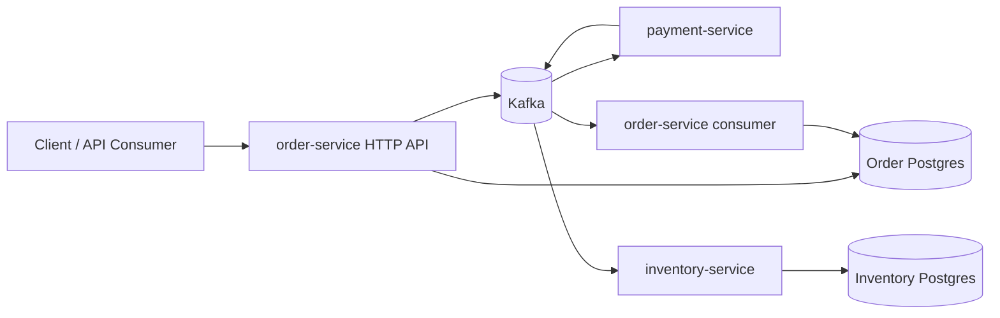
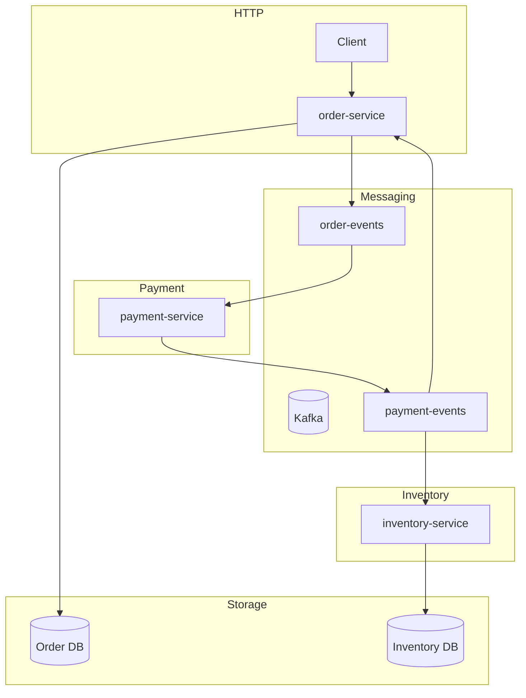
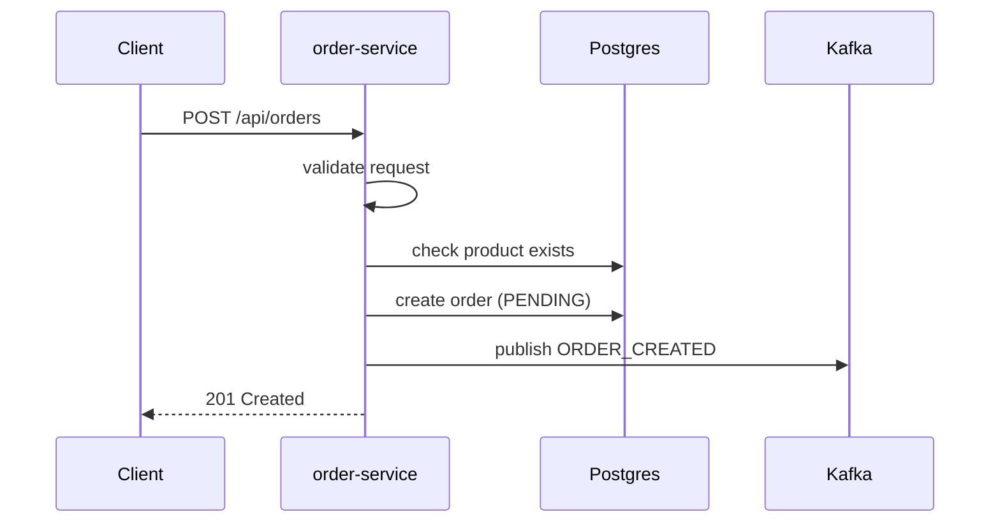
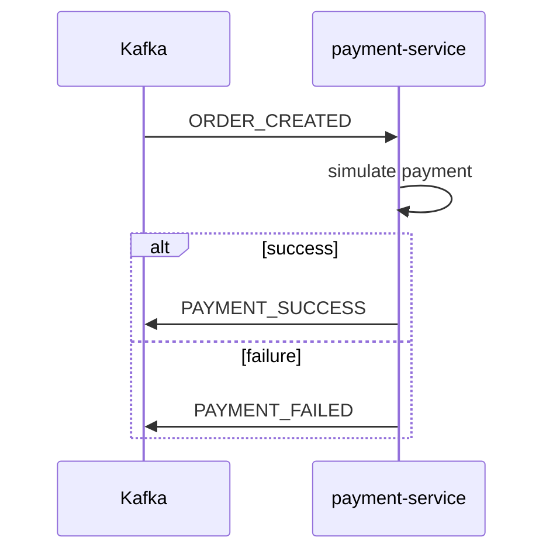
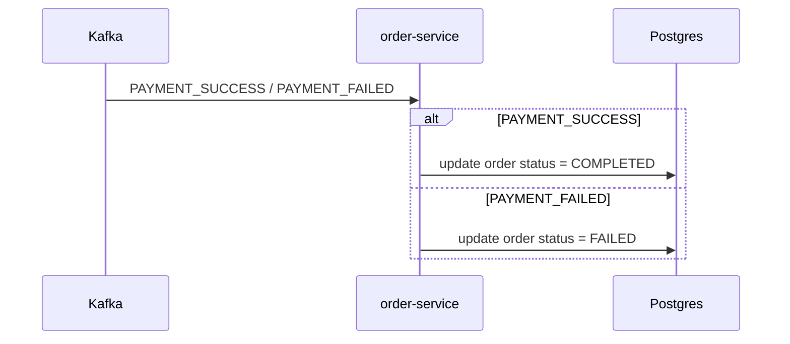
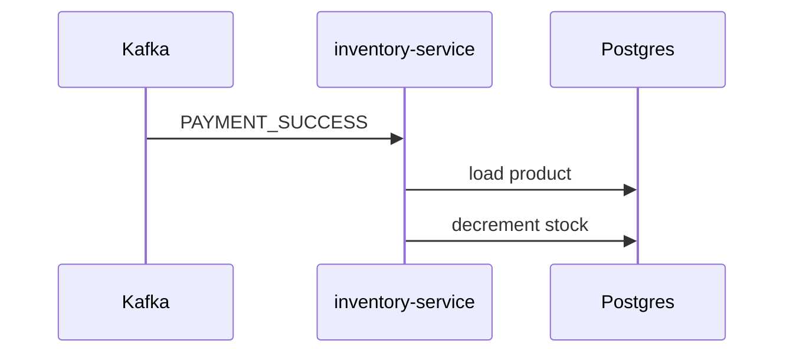

# RMS Architecture

## Overview

RMS is an event-driven microservice system for order processing, payment handling, and inventory updates.

It is split into three services:

- `order-service`
- `payment-service`
- `inventory-service`

Kafka is the messaging backbone. PostgreSQL is used for persistence through Prisma.

## Goals

- Accept order requests over HTTP.
- Process payment asynchronously.
- Update order status based on payment outcome.
- Reduce inventory only after successful payment.
- Keep services loosely coupled.

## Repository Layout

- `docker-compose.yml`: starts Kafka and ZooKeeper.
- `order-service/`: HTTP API, order creation, order status updates.
- `payment-service/`: payment simulation and payment result events.
- `inventory-service/`: stock updates after successful payment.
- `flow.excalidraw`: likely a system diagram or flow sketch.

## System Context



## High-Level Architecture



## Service Responsibilities

### `order-service`

Main responsibilities:

- Expose the HTTP API.
- Validate order input.
- Create orders in the database.
- Publish `ORDER_CREATED` events.
- Consume payment outcome events.
- Update order status.

Main files:

- `src/server.ts`
- `src/app.ts`
- `src/routes/order.routes.ts`
- `src/controllers/order.controller.ts`
- `src/kafka/producer.ts`
- `src/kafka/consumer.ts`
- `src/prisma.ts`

### `payment-service`

Main responsibilities:

- Consume `ORDER_CREATED` events.
- Simulate payment processing.
- Publish payment outcome events.

Main files:

- `src/index.ts`
- `src/kafka/consumer.ts`
- `src/kafka/producer.ts`
- `src/handlers/payment.handler.ts`

### `inventory-service`

Main responsibilities:

- Consume `PAYMENT_SUCCESS` events.
- Decrement product stock.
- Ignore non-success payment events.

Main files:

- `src/index.ts`
- `src/kafka/consumer.ts`
- `src/handlers/inventory.handler.ts`
- `src/prisma.ts`

## Runtime Flow

### Order creation



### Payment processing



### Order status update



### Inventory update



## Order Service Details

### Startup

`src/server.ts`:

- loads environment variables
- connects the Kafka producer
- starts the Kafka consumer
- starts the Express server

### HTTP API

`src/app.ts` mounts routes under `/api`.

Routes:

- `POST /api/orders`
- `GET /api/orders/:orderId`

### Create Order

`src/controllers/order.controller.ts`:

- validates `userId` and `productId`
- checks that the product exists
- creates an order with `status = PENDING`
- publishes an `ORDER_CREATED` event to `order-events`

### Get Order

Returns the order record by ID.

### Kafka Consumer

`src/kafka/consumer.ts`:

- subscribes to `payment-events`
- handles:
  - `PAYMENT_SUCCESS` -> sets order status to `COMPLETED`
  - `PAYMENT_FAILED` -> sets order status to `FAILED`

## Payment Service Details

### Startup

`src/index.ts`:

- connects the Kafka producer
- starts the Kafka consumer

### Kafka Consumer

`src/kafka/consumer.ts`:

- subscribes to `order-events`
- handles only `ORDER_CREATED`

### Payment Handler

`src/handlers/payment.handler.ts`:

- simulates payment with a 70 percent success rate
- waits briefly to mimic processing latency
- publishes:
  - `PAYMENT_SUCCESS`
  - or `PAYMENT_FAILED`

## Inventory Service Details

### Startup

`src/index.ts`:

- starts the Kafka consumer

### Kafka Consumer

`src/kafka/consumer.ts`:

- subscribes to `payment-events`
- handles only `PAYMENT_SUCCESS`

### Inventory Handler

`src/handlers/inventory.handler.ts`:

- loads the product by `productId`
- checks current stock
- decrements stock by 1 if available

## Kafka Topics

### `order-events`

Published by:

- `order-service`

Consumed by:

- `payment-service`

Event type:

- `ORDER_CREATED`

### `payment-events`

Published by:

- `payment-service`

Consumed by:

- `order-service`
- `inventory-service`

Event types:

- `PAYMENT_SUCCESS`
- `PAYMENT_FAILED`

## Event Payloads

### `ORDER_CREATED`

```json
{
  "type": "ORDER_CREATED",
  "orderId": "uuid",
  "userId": "uuid",
  "productId": "uuid",
  "timestamp": "2026-06-16T00:00:00.000Z"
}
```

### `PAYMENT_SUCCESS`

```json
{
  "type": "PAYMENT_SUCCESS",
  "orderId": "uuid",
  "userId": "uuid",
  "productId": "uuid",
  "timestamp": "2026-06-16T00:00:00.000Z"
}
```

### `PAYMENT_FAILED`

```json
{
  "type": "PAYMENT_FAILED",
  "orderId": "uuid",
  "userId": "uuid",
  "productId": "uuid",
  "timestamp": "2026-06-16T00:00:00.000Z",
  "reason": "Payment declined - insufficient funds"
}
```

## Data Model

### `order-service`

Prisma models:

- `User`
- `Product`
- `Order`

`Order` fields:

- `id`
- `userId`
- `productId`
- `status`
- `createdAt`

### `inventory-service`

Prisma model:

- `Product`

`Product` fields:

- `id`
- `name`
- `price`
- `stock`

### Outbox Table

The `order-service` migration includes an `order_event_outbox` table, which suggests an outbox pattern for reliable event publishing.

Columns include:

- `orderId`
- `eventType`
- `eventPayload`
- `createdAt`
- `publishedAt`
- `publishAttempts`
- `lastError`

At the moment, the runtime still publishes directly to Kafka.

## Local Development

### Infrastructure

`docker-compose.yml` starts:

- ZooKeeper on `2181`
- Kafka on `9092`

### Common environment variables

- `DATABASE_URL`
- `KAFKA_BROKER`
- `PORT` for `order-service`

### Common scripts

- `npm run dev`
- `npm run build`
- `npm run prisma:migrate`
- `npm run prisma:generate`
- `npm run prisma:studio`

Each service has its own `package.json` and runs independently.

## Known Issues

### Schema mismatch

There is a current mismatch between code and migrations:

- `order-service` migration drops `Product.stock`
- runtime code still expects `stock` in both `order-service` and `inventory-service`

This affects the inventory flow and should be resolved before treating the system as production-ready.

### Simulated payments

Payment processing is random and not connected to a real gateway.

### Simplified messaging

The current implementation is a basic event-driven flow, not a full saga or distributed transaction system.

## Troubleshooting

### Kafka connection failures

Check:

- Docker is running
- Kafka is reachable at `localhost:9092`
- `KAFKA_BROKER` is set correctly

### Orders stay `PENDING`

Check:

- `payment-service` is running
- `payment-events` are being published
- `order-service` consumer is connected

### Inventory does not change

Check:

- `inventory-service` is running
- `PAYMENT_SUCCESS` events are received
- product stock exists in the active schema

### Prisma errors

Check:

- `DATABASE_URL`
- migrations are applied
- Prisma client is generated

## Summary

RMS is an event-driven order pipeline:

- HTTP enters through `order-service`
- Kafka carries events between services
- `payment-service` simulates payment
- `order-service` updates order status
- `inventory-service` updates stock on successful payment

The architecture is clean and modular, but the schema mismatch should be fixed to make the runtime behavior match the intended model.
